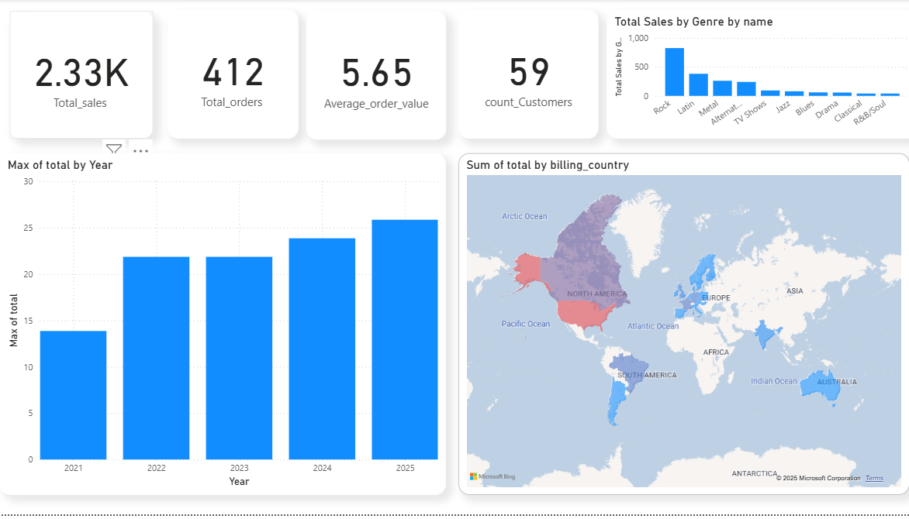
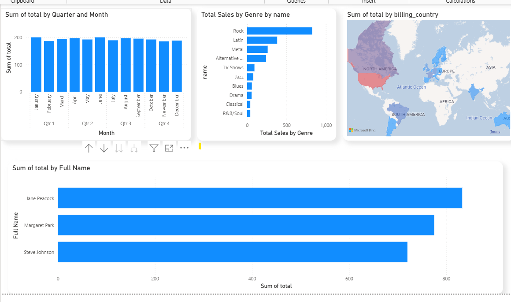
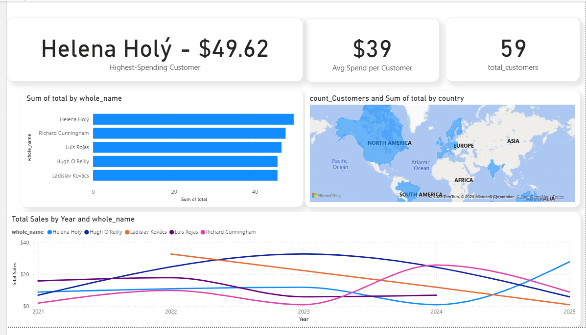
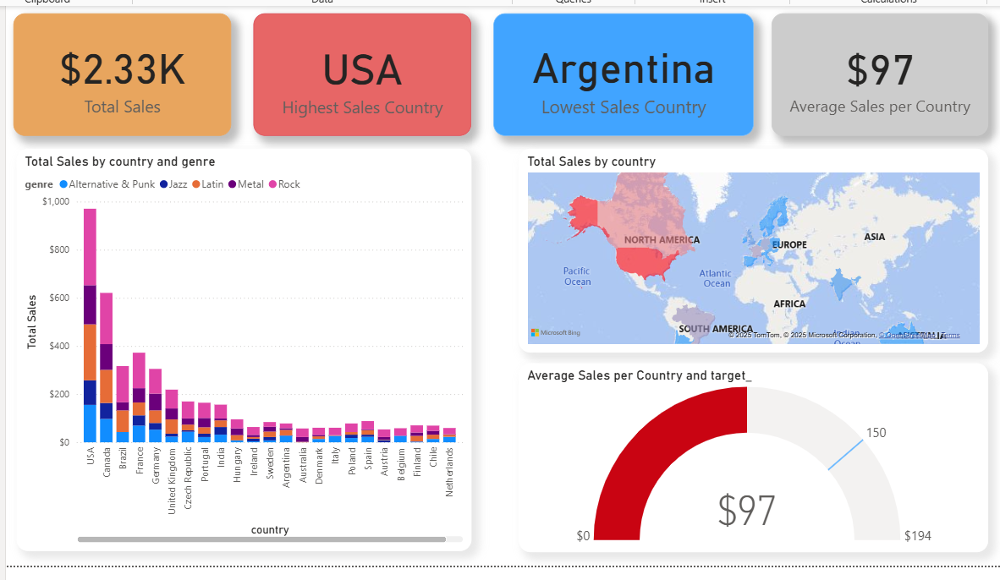

# 🎶 Chinook Database Analysis – Power BI Project  

## 📌 Project Overview  
This project uses the **Chinook database** (a sample database containing music store sales data) to demonstrate **data analysis, modeling, and visualization skills** in Power BI.  

The main objectives were to:  
- Import and model SQL data in Power BI  
- Clean and transform raw tables into a usable star schema  
- Build interactive dashboards for **business insights**  
- Highlight skills in **SQL, data cleaning, and visualization**  

---

## 📂 Dataset  
The dataset is the **Chinook SQL database**, which includes:  
- 🎵 **Tracks, Albums, Artists**  
- 🛒 **Invoices & Invoice Lines**  
- 👥 **Customers & Employees**  
- 🌍 **Countries**  

Data was downloaded in SQL format and then connected to Power BI.  
and you can look to the files uploaded for sql files 

---

## 🔧 Data Preparation  
1. **Imported SQL tables** into Power BI  
2. Created **relationships** between tables (e.g., `Customer` → `Invoice` → `InvoiceLine`)  
3. Performed **data cleaning & transformation**:  
   - Removed duplicates & nulls  
   - Adjusted country names for consistency  
   - Created calculated columns & measures for KPIs  

---

## 📊 Dashboard Pages  

### 1️⃣ Overview  
- Total Revenue, Orders, Customers  
- KPIs with year-over-year comparisons  
- High-level business summary  

### 2️⃣ Sales Analysis  
- Revenue by Genre, Artist, Album  
- Monthly sales trend  
- Top-selling tracks & formats  

### 3️⃣ Customer Insights  
- Revenue by customer segment  
- Repeat vs. new customers  
- Customer lifetime value (CLV) insights  

### 4️⃣ Country Analysis  
- Revenue distribution by country  
- Top contributing regions  
- Map visualization of global sales  

---

## 🎯 Key Insights  
- The majority of sales come from **top 5 countries**, indicating a concentration of customers.  
- **Rock** is the most purchased genre.  
- A few **high-value customers** contribute a large share of revenue.  
- Seasonal sales trends show peaks in certain months.  

---

## 🛠️ Tools & Skills Demonstrated  
- **SQL** (importing and understanding relational data)  
- **Power BI** (data modeling, DAX, visualization, dashboards)  
- **Data Cleaning** & Transformation  
- **Business Analysis** & storytelling with data  

---

## 📷 Screenshots  

  
  
 
 

---

## 🚀 How to Use  
- Clone this repository  
- Open the `.pbix` file in Power BI Desktop  
- Explore the dashboards interactively  

---

## 📌 About Me  
I’m a **Data Analyst** skilled in SQL, Power BI, Python, and data visualization.  
This project demonstrates my ability to turn raw relational data into **actionable insights**.  
## 📬 Contact  
- Email: yasserhassen98@gmail.com
- LinkedIn: [linkedin.com/in/yourprofile](www.linkedin.com/in/hassan-yasser-2000hh)  
- GitHub: [github.com/yourusername](https://github.com/sonh2000)  

